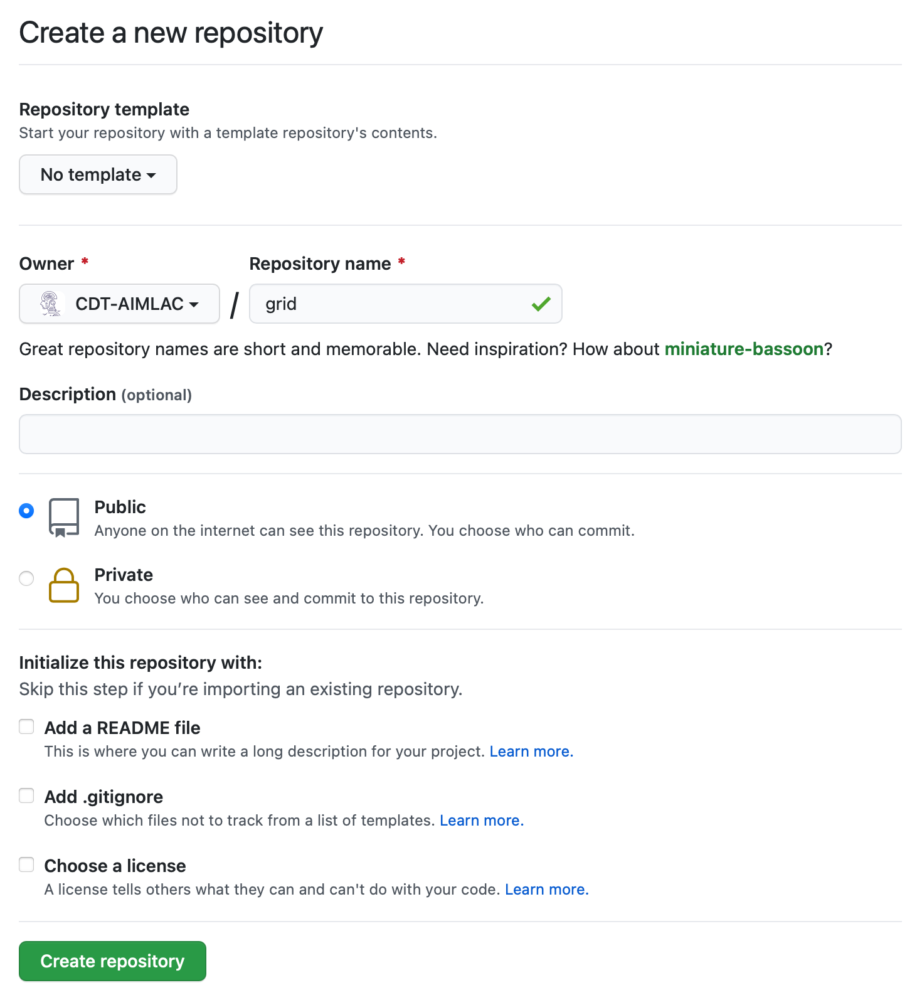
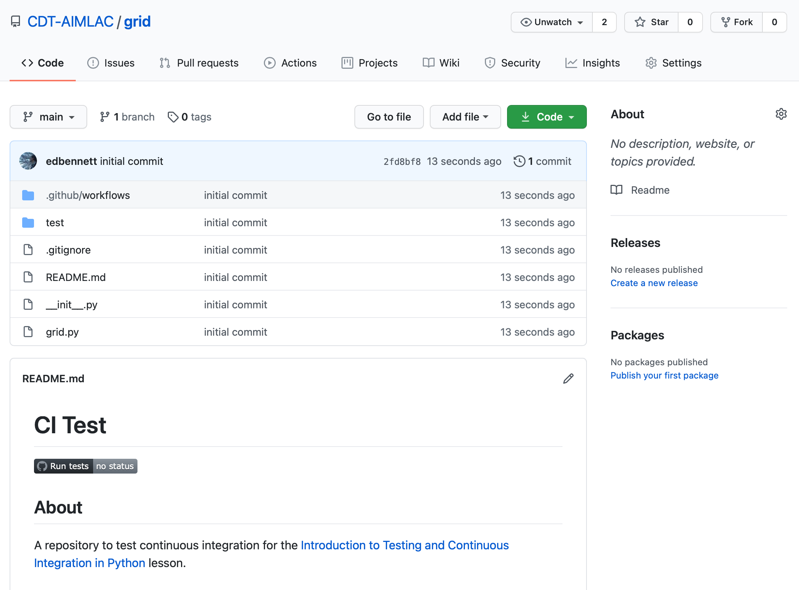
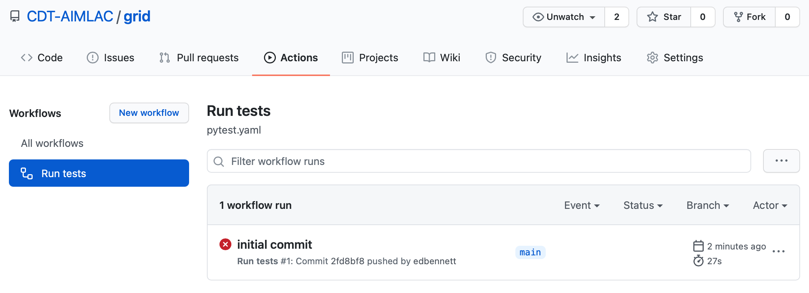
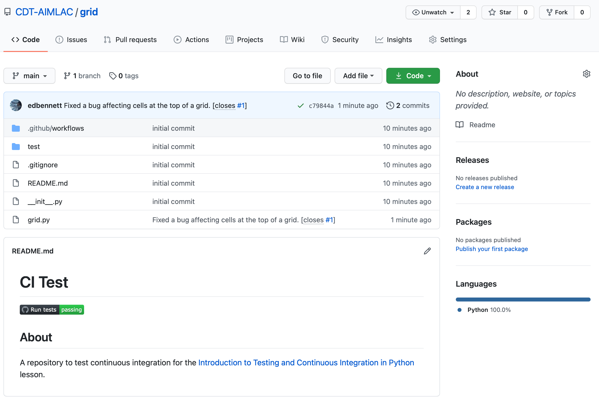
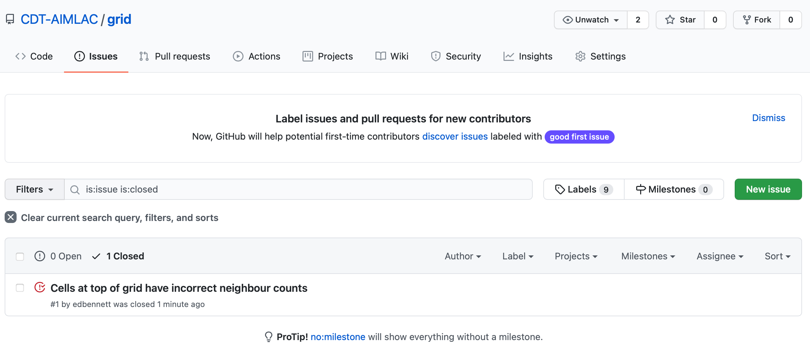
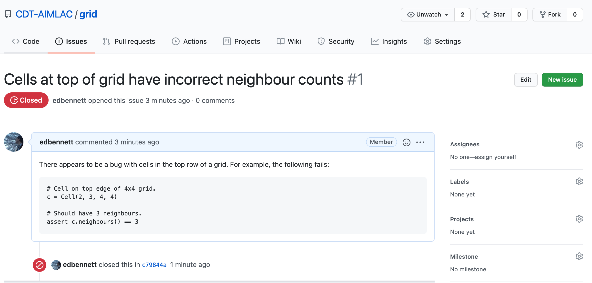
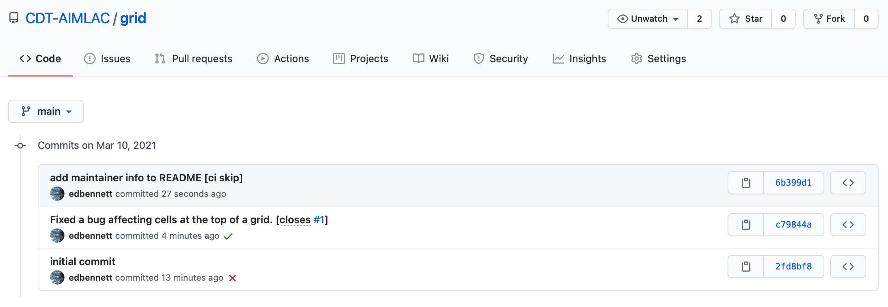

So far, we have been running tests on a single machine by invoking `pytest` from
the command line. Every time we make changes to the code we manually re-run the
tests in order to check that our changes haven't broken anything.

In a software project there might be many developers working on different parts
of the code remotely, then pushing their changes (commits) to a centralised
repository, such as one on [GitHub][github]. How can we make sure that tests are
run whenever a new commit is received and that we are notified whenever a change
breaks the code?

When running tests on your local machine you can be confident that the code is
working in your environment, i.e. your operating system, version of Python, etc.
How can we be sure that the code will work on a range of environments?

[Continuous integration][ci] (or CI) is the practice that attempts to solve
these problems. The idea is that every time a new commit is pushed a CI server
sets up a clean environment, does a `git clone` of your code from the central
repository, then attempts to build it and run any tests. This means that you can
guarantee that for every commit you make, the software will build and run on a
clean machine without manual intervention, and that the test suite
passes&mdash;or at least, if it doesn't, you'll get warned about it, so you know
to fix it.

There are many fantastic CI services, most of which offer at least some level of
service free of charge. In this course we will use GitHub Actions, since it
integrates well with GitHub.

## Configuring the CI build

Central to GitHub Actions is the concept of a _workflow_. Each workflow defines
a set of steps that GitHub will take, and tells GitHub when to take them.
Workflows are stored in the `.github/workflows/` directory; the `.` at the start
of the filename means that the directory is hidden at the shell by default.

Workflows are defined in [YAML][yaml] files (short for "YAML Ain't Markup
Language"). A typical workflow might looks something like this:

~~~
name: Run tests

on:
  push:
    branches: [ main ]
  pull_request:
    branches: [ main ]

jobs:
  build:

    runs-on: ubuntu-latest
    strategy:
      matrix:
        python-version: [3.7, 3.8, 3.9]

    steps:
    - uses: actions/checkout@v2
    - name: Set up Python ${{ matrix.python-version }}
      uses: actions/setup-python@v2
      with:
        python-version: ${{ matrix.python-version }}
    - name: Install dependencies
      run: |
        python -m pip install --upgrade pip
        python -m pip install pytest
    - name: Test with pytest
      run: |
        pytest
~~~
{: .language-yaml}

This is a decent chunk of content, so let's break it down. At the highest level,
there are three items: `name`, `on`, and `jobs`. `name` defines a name for the
action, so if you have many actions you can identify which one has done what.
`on` identifies when this action should run. In this case we run the action
whenever there is a push to the `main` branch, or a pull request to it. Finally,
we define one job, which is to build (and run) the software).

The `build` job then defines what it needs: to run on the most recent version of
Ubuntu, and to test three Python versions, each of which will run entirely
separately. Then it lists the steps that it will perform: first it checks out
the repository, then sets up the version of Python selected for this run, then
install any dependencies necessary for the software to run, and finally run
`pytest`.

> ## Actions beyond tests
>
> If this seems unnecessarily complicated to run some tests whenever we push to
> a repository, you're not wrong. GitHub Actions is designed to be useful in a
> wide variety of cases beyond running a test suite&mdash;for example, it can
> also build packaged applications for release whenever a release is tagged, or
> even kick off a full analysis pipeline when new data are added to a
> repository.
>
> You can also test on systems other than Linux, so if you don't have a Windows
> or macOS machine available to test on, you can still verify that your software
> works on those platforms.
>
> We're only scratching the surface today of what GitHub actions can do. But
> even a very small subset of its features is enough to give us significant
> benefits!
{: .callout}

## Your first CI build

We'll now walk through the process of running your first CI build. Before
starting you'll need to open a terminal by locating the Home Jupyter tab,
clicking on the **New** dropdown button near the top right, then selecting
**Terminal** from the list. For convenience, it might be preferable to split
your screen so the terminal tab is next to this one. That way you can follow
through the tutorial as you execute various commands.

First move into the `grid` directory. This has already been set up with a
`.github/workflows/pytest.yaml` and a GitHub `README.md` file.

~~~
$ cd grid
~~~
{: .language-bash}

Edit `README.md` so that both occurrences of `USERNAME` are replaced by your
GitHub username.

Also edit `grid.py` to re-introduce the bug that you fixed earlier. (Replace
`h-1` with `w` on line 133.) Run `pytest` to check that the tests fail.

~~~
$ pytest
~~~
{: .language-bash}

Now initialise a new git repository.

~~~
$ git init
~~~
{: .language-bash}

Add all of the files in the directory and stage them for the commit.

~~~
$ git add .
~~~
{: .language-bash}

Commit the files that you've staged in your local repository.

~~~
$ git commit -m "Initial commit."
~~~
{: .language-bash}

Finally, rename the branch to `main`, to match the branch name we are checking
for pushes to in our workflow.

~~~
$ git branch -M main
~~~
{: .language-bash}

Go to your [GitHub][github] profile page and create a new repository called
`grid`. (It's important that you use this exact name!) To do so click on the
**Repositories** tab, then the **New** button. Set the Repository template to
"No template", and leave the check boxes for "Add a README file", "Add
.gitignore", and "Choose a license" _unchecked_.

Back on the command line we can now add a URL for the new remote repository that
you just created. Once again, replace `USERNAME` with your actual GitHub
username.

~~~
$ git remote add origin remote https://github.com/USERNAME/grid.git
~~~
{: .language-bash}

You can now push your commit to the remote repository.

~~~
$ git push origin main
~~~
{: .language-bash}

Since we included a `.github/workflows/pytest.yaml` workflow to run on commit to
the default branch, GitHub will automatically detect this and initiate a build.
If you visit the GitHub page for the repository you will see a build status
image on the main page.

Clicking on this will take you to the GitHub Actions page for the test workflow,
where you can see the progress of the current build, as well as the details of
any previous builds. You should see the status reported as failed. In addition,
you might also receive an email notifying you of the error.

> ## Don't do this
>
> It's normally bad practice to push code that you know is broken. In this case
> we're using it as an example to show how to go about fixing it in the correct
> way. In general, run your test suite before committing, and definitely before
> pushing, to avoid publishing the repository in a state where someone else
> can't clone and start using it.
{: .callout}

## Creating an issue

Because we've noticed that the tests are failing, we can open an _issue_ on
GitHub to alert people to this. Click on the **Issues** tab followed by the
**New issue** button. Give your issue whatever title you like, then hit submit.
It's good practice to give a minimal example that illustrates the problem. This
helps the owner of the repository to reproduce the problem. You could also
provide a new unit test if none of the current ones trigger the bug. In this
case, we already have a good test that catches the error.

## Pushing a fix

Back in your local repository fix the bug that you introduced earlier and verify
that the tests now pass. Having done this you can stage the `grid.py` file, then
commit the change. For simplicity we'll do this in a single step.

~~~
$ git commit grid.py -m "Fixed a bug affecting cells at the top of a grid. [closes #1]"
~~~
{: .language-bash}

Now push the commit to GitHub.

~~~
$ git push
~~~
{: .language-bash}

The commit will now appear on GitHub, and GitHub Actions will run another build
using the updated version of the code. Once the build is complete you should
hopefully see a green status badge on the repository homepage to indicate that
it passed.

Take another look at the **Issues** tab. You should see that the issue that you
opened is now _closed_. This happened automatically because we included the
phrase "`closes #1`" somewhere in our commit message. Here `#1` is the issue
number&mdash;in this case, indicating that it is the first issue that was
opened.

## Skipping a CI build

Sometimes you might commit changes that don't affect the functionality of the
code, e.g. comments, or changes to the `README.md` file. In this case there is
no need to run another CI build since none of the changes will affect the result
of the tests. Since a build can be a time consuming process, and GitHub only
gives us a certain number of free minutes of actions per month, it would be
wasteful to run one if wasn't absolutely necessary.

Thankfully there is a flag that can be added to commit messages in order to
indicate that a CI build should be skipped, `[ci skip]`.

Edit the README.md file to include a new line saying "Testing is great!" (or
whatever you prefer). Now commit your changes.

~~~
$ git commit README.md -m "Updated the README. [ci skip]"
~~~
{: .language-bash}

Finally push the changes to GitHub.

~~~
$ git push
~~~
{: .language-bash}

If you go to the GitHub page for your `grid` repository you should find that
there wasn't a third CI build. On the GitHub page you can click on where it says
"`3 commits`" to show the commit history. There should be a red cross (failed)
next to the first commit, a green tick (passed) next to the second, and nothing
(skipped) next to the third.

> ## Other GitHub actions
>
> GitHub has a whole catalogue of example workflows available that can do a wide
> variety of things. A few are suggested when you click the **New Workflow**
> button in the **Actions** tab, and more can be found at [the
> `starter-workflows` repository](starter-workflows). Some possibilities are to
> automatically push new releases to [PyPI][pypi], and to automatically style
> check all code against a defined house style (for example, PEP 8).
{: .callout}

> ## Try it yourself
>
> Switch now to the `dice` directory. Set up this directory to be a git
> repository, hosted on GitHub, and using GitHub actions for CI.
>
> To do this:
>
> 1. Create a new `.github/workflows/` directory.
> 2. Create a `pytest.yaml` file inside this directory. You can use the example
>    shown above as the basis for it.
> 3. Use `git init`, `git add`, and `git commit` to commit the relevant files to
>    the repository.
> 4. Create a new repository on GitHub. Use `git remote add` to connect your
>    local repository to the one you've just made.
> 5. Use `git push` to push your local repository up to GitHub.
> 6. Check that the tests ran, and passed.
>
> If you have time, try also adding the badge to your `README.md` that indicates
> whether the most recent CI build succeeded or not.
{: .challenge}

[ci]: https://en.wikipedia.org/wiki/Continuous_integration
[github]: https://github.com
[pypi]: https://pypi.org
[starter-workflows]: https://github.com/actions/starter-workflows
[yaml]: https://en.wikipedia.org/wiki/YAML
